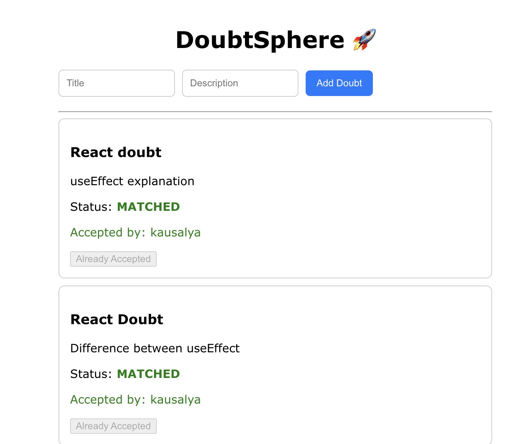

# DoubtSphere 🚀

A full-stack real-time doubt resolution platform with a first-accept locking system.

## Features

- Create and view doubts
- First-accept system (only one user can accept)
- Status flow: OPEN → MATCHED
- Clean UI with React
## 👩‍💻 Developed By

Kausalya Hariharan

## 🚀 My Contribution

- Built full-stack doubt resolution platform  
- Implemented first-accept system  
- Integrated MongoDB with backend APIs  
- Designed responsive UI using React

## 📸 Screenshots

### Home UI

### Add Doubt

### Accept Flow

## 🎥 Demo Video

[Watch Demo](https://github.com/Kausalya-H/DoubtSphere/blob/main/screenshots/demo.mov)
